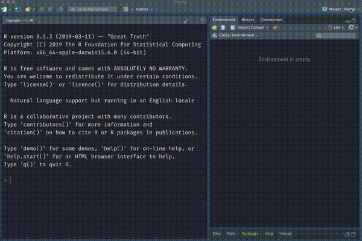
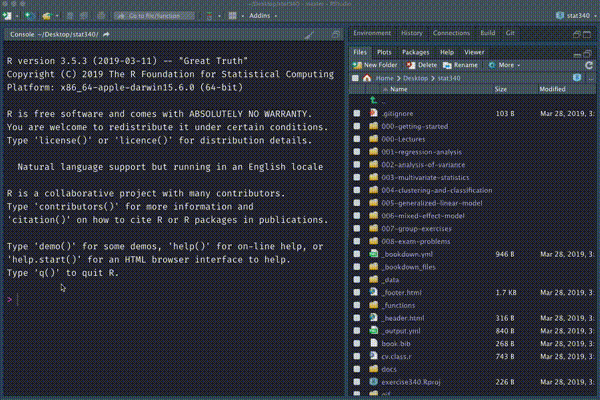
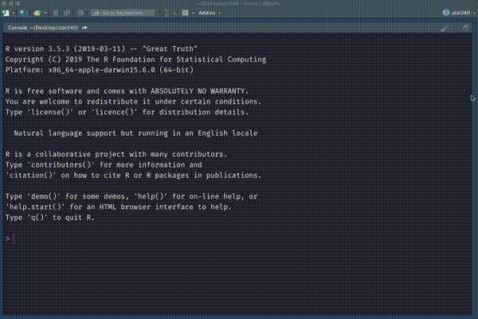

# Applied Methods in Statistics (STAT340)

This repository contains the exercises of NMBU course on Applied Methods in Statistics (STAT340). In order to maintain this repository following are the steps:

  

  a) Make a Github Account
  

  

  

  b) Make a fork (copy) of this repository (mathatistics/stat340-2019) to your own Github account
  

  

  

  c) To update and edit the exercises from your own computer, you need install Git in your system
  

  Find some [tutorial in Youtube](https://www.youtube.com/watch?v=eo00v2aw92Y)

  

  d) Once you have your git installed, you can setup a project in Rstudio with this newly forked repository
  

  

  

  e) Fix the user.name and user.email and related git configuration
  

  

  

  f) If you make a change in files like Readme where you don't need to build the whole project, you can just commit the changes and push the changes to github to your repository
  

  

  

  g) If you make changes that need to be compiled, you need to build the project which will run all the R-script and create a website (required files) and a PDF file of the exercise
  

  

[A YouTube playlist](https://youtu.be/efymWsFhMu4) contains the video of these steps.

